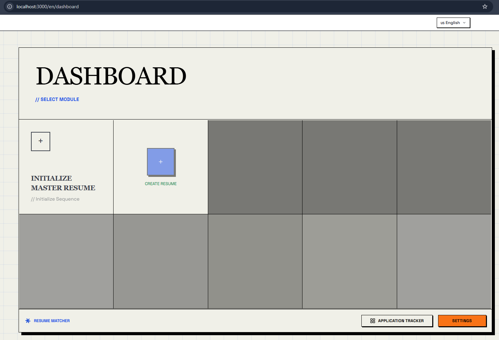
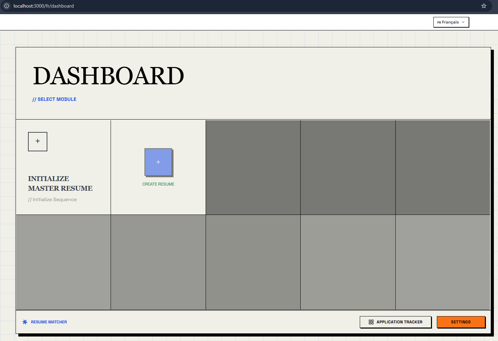

<div align="center">

[](https://www.resumematcher.fyi)

# Resume Matcher

### *A multi-tenant fork of [Resume Matcher](https://github.com/srbhr/Resume-Matcher)*

[𝙶𝚒𝚝𝙷𝚞𝚋](https://github.com/icemc/Resume-Matcher) ✦ [𝙳𝚘𝚌𝚔𝚎𝚛 𝙷𝚞𝚋](https://hub.docker.com/r/abanda/resume-matcher) ✦ [𝙷𝚘𝚠 𝚝𝚘 𝙸𝚗𝚜𝚝𝚊𝚕𝚕](#how-to-install) ✦ [𝙸𝚜𝚜𝚞𝚎𝚜](https://github.com/icemc/Resume-Matcher/issues) ✦ [𝙾𝚛𝚒𝚐𝚒𝚗𝚊𝚕 𝙿𝚛𝚘𝚓𝚎𝚌𝚝](#original-project--attribution)

Create tailored resumes for each job application with AI-powered suggestions. Works locally with Ollama or connect to your favorite LLM provider via API.


*(core resume-tailoring flow, inherited from the original project)*

</div>

<br>

<div align="center">


  

[](https://hub.docker.com/r/abanda/resume-matcher)

</div>

> \[!IMPORTANT]
>
> **This is an independent fork.** The core Resume Matcher product — the resume builder, AI tailoring, cover letters, scoring, and templates — was designed and built by **[Saurabh Rai](https://github.com/srbhr)** and the [original Resume Matcher](https://github.com/srbhr/Resume-Matcher) community. This fork exists to add a **multi-tenant, language-as-tenant architecture** on top of that work (see [What's New in This Fork](#whats-new-in-this-fork) below). It is not affiliated with, endorsed by, or maintained by the original team.
>
> For the **official website, live updates, Discord community, and sponsorship**, please go to the original project — see [Original Project & Attribution](#original-project--attribution).

## What's New in This Fork

Every supported language is now its own **tenant** — a fully isolated workspace with its own URL, its own master resume, its own tailored resumes, and its own Application Tracker board. Nothing is shared between tenants except one global UI-chrome language setting.

| `/en/dashboard` | `/fr/dashboard` |
|---|---|
|  |  |

- **Per-language dashboards** at their own URL (`/en/dashboard`, `/fr/dashboard`, `/es/dashboard`, ...) for every supported language (English, Spanish, Chinese, Japanese, Portuguese, **French** — new in this fork).
- **Full feature parity per tenant** — CV management, tailoring, cover letters, outreach, AI enrichment, and the tracker all work independently inside each language's own workspace.
- **A tenant switcher** in the top nav shows which languages are already configured (have a master resume) versus not yet set up, and lets you jump between them in one click.
- **UI language stays global** — the interface language (buttons, labels, navigation) is one setting shared across every tenant, separate from which tenant/content-language you're currently working in.
- Backend enforces tenant isolation at the data layer: one master resume per language (not one globally), and every list/create/upload endpoint requires an explicit tenant.

Full technical write-up: [`docs/plans/language-tenant-dashboards.md`](docs/plans/language-tenant-dashboards.md).

## Getting Started

Resume Matcher works by creating a master resume that you can use to tailor for each job application. Installation instructions here: [How to Install](#how-to-install)

### How It Works

1. **Upload** your master resume (PDF or DOCX)
2. **Paste** a job description you're targeting
3. **Review** AI-generated improvements and tailored content
4. **Cover Letter** generator for the job application
5. **Customize** the layout and sections to fit your style
6. **Export** as a professional PDF with your preferred template

Every step above happens inside whichever language tenant you're currently in — see [What's New in This Fork](#whats-new-in-this-fork).


Star [this repo](https://github.com/icemc/Resume-Matcher) to support the fork and get notified of new releases.

## Key Features


### Core Features

**Master Resume**: Create a comprehensive master resume to draw from your existing one.


### Resume Builder


Paste in a job description and get AI-powered resume tailored for that specific role.

You can:

- Modify suggested content
- Add/remove sections
- Rearrange sections via drag-and-drop
- Choose from multiple resume templates

### Cover Letter Generator

Generate tailored cover letters based on the job description and your resume.


### Resume Scoring & Keyword Highlighting

Analyze your resume against the job description with a match score, keyword highlighting, and suggestions for improvement.


### Application Tracker

A 7-column Kanban board (Saved → Applied → No Response → Response → Interview → Accepted → Rejected) for tracking every application, scoped to its language tenant.

### PDF Export

Export your tailored resume and cover letter in PDF.

### Templates

| Template Name | Preview | Description |
|---------------|---------|-------------|
| **Classic Single Column** |  | A traditional and clean layout suitable for most industries. [𝐕𝐢𝐞𝐰 𝐏𝐃𝐅](assets/pdf-templates/single-column.pdf) |
| **Modern Single Column** |  | A contemporary design with a focus on readability and aesthetics. [𝐕𝐢𝐞𝐰 𝐏𝐃𝐅](assets/pdf-templates/modern-single-column.pdf)|
| **Classic Two Column** |  | A structured layout that separates sections for clarity. [𝐕𝐢𝐞𝐰 𝐏𝐃𝐅](assets/pdf-templates/two-column.pdf)|
| **Modern Two Column** |  | A sleek design that utilizes two columns for better organization. [𝐕𝐢𝐞𝐰 𝐏𝐃𝐅](assets/pdf-templates/modern-two-column.pdf)|

### Internationalization

- **Multi-Language UI**: Interface available in English, Spanish, Chinese, Japanese, Portuguese (Brazilian), and French — one global setting shared across every tenant.
- **Multi-Language Content, Per Tenant**: Each language tenant generates resumes and cover letters in its own language — see [What's New in This Fork](#whats-new-in-this-fork).

### Roadmap

If you have any suggestions or feature requests for this fork, please [open an issue](https://github.com/icemc/Resume-Matcher/issues).

- AI Canvas for crafting impactful, metric-driven resume content
- Email template generator for job applications
- Multi-job description optimization

<a id="how-to-install"></a>

## How to Install


For detailed setup instructions, see **[SETUP.md](SETUP.md)**.

### Prerequisites

| Tool | Version | Installation |
|------|---------|--------------|
| Python | 3.13+ | [python.org](https://python.org) |
| Node.js | 22+ | [nodejs.org](https://nodejs.org) |
| uv | Latest | [astral.sh/uv](https://docs.astral.sh/uv/getting-started/installation/) |

### Quick Start

Fastest for MacOS, WSL and Ubuntu users:

```bash
# Clone the repository
git clone https://github.com/icemc/Resume-Matcher.git
cd Resume-Matcher

# Backend (Terminal 1)
cd apps/backend
cp .env.example .env        # Configure your AI provider
uv sync                      # Install dependencies
uv run app

# Frontend (Terminal 2)
cd apps/frontend
npm install
npm run dev
```

Open **<http://localhost:3000>** and configure your AI provider in Settings.

### Supported AI Providers

| Provider | Local/Cloud | Notes |
|----------|-------------|-------|
| **Ollama** | Local | Free, runs on your machine |
| **OpenAI** | Cloud | GPT-5 Nano, GPT-4o |
| **Anthropic** | Cloud | Claude Haiku 4.5 |
| **Google Gemini** | Cloud | Gemini 3 Flash |
| **OpenRouter** | Cloud | Access to multiple models |
| **DeepSeek** | Cloud | DeepSeek Chat |
| **OpenAI-Compatible** | Local/Cloud | Any server exposing the OpenAI Chat Completions API (llama.cpp, vLLM, LM Studio, NVIDIA NIM, ...) |

### Docker Deployment

This fork's images are published for `linux/amd64` and `linux/arm64` on:

- `ghcr.io/icemc/resume-matcher`
- `abanda/resume-matcher`

Run on a single public port (`3000`) with API available at `/api`:

```bash
docker run --name resume-matcher \
  -p 3000:3000 \
  -v resume-data:/app/backend/data \
  abanda/resume-matcher:latest
```

Prefer pinning a version in production, for example `abanda/resume-matcher:v1.2.1-RC1`.

Endpoints:

- App: <http://localhost:3000>
- API health check: <http://localhost:3000/api/v1/health>
- API docs: <http://localhost:3000/docs>

> **Using Ollama with Docker?** Use `http://host.docker.internal:11434` as the Ollama URL instead of `localhost`.

### Tech Stack

| Component | Technology |
|-----------|------------|
| Backend | FastAPI, Python 3.13+, LiteLLM |
| Frontend | Next.js 16, React 19, TypeScript |
| Database | SQLite (SQLAlchemy 2.0 async / aiosqlite) |
| Styling | Tailwind CSS 4, Swiss International Style |
| PDF | Headless Chromium via Playwright |

## Join Us and Contribute


We welcome contributions to this fork! Whether you're a developer, designer, or just someone who wants to help out — open an issue or pull request on [this repository](https://github.com/icemc/Resume-Matcher).

Check out the roadmap above if you'd like to work on planned features. See [`.github/CONTRIBUTING.md`](.github/CONTRIBUTING.md) for the contribution guide.

<a id="contributors"></a>

## Contributors

<a href="https://github.com/icemc/Resume-Matcher/graphs/contributors">
  
</a>

<br/>

<details>
  <summary><kbd>Star History</kbd></summary>
  <picture>
    <source media="(prefers-color-scheme: dark)" srcset="https://api.star-history.com/svg?repos=icemc/resume-matcher&theme=dark&type=Date">
    
  </picture>
</details>

<a id="original-project--attribution"></a>

## Original Project & Attribution

This repository is a fork of **[Resume Matcher](https://github.com/srbhr/Resume-Matcher)**, created and maintained by **Saurabh Rai** ([@srbhr](https://github.com/srbhr)) and its contributors. All of the core product — resume parsing, AI tailoring, the builder, cover letters, scoring, and templates — is their work. This fork builds the multi-tenant language architecture on top of it; everything else described above belongs to the original project.

We don't have our own website, Discord, or social presence yet, so for all of the following, please go to the **original project**:

| | |
|---|---|
| 🌐 Website & live preview | [resumematcher.fyi](https://resumematcher.fyi) |
| 💬 Discord community | [dsc.gg/resume-matcher](https://dsc.gg/resume-matcher) |
| 🐦 Twitter/X | [@srbhrai](https://twitter.com/srbhrai) |
| 💼 LinkedIn | [Resume Matcher](https://www.linkedin.com/company/resume-matcher/) |
| 👤 Creator | [srbhr.com](https://srbhr.com) |

### Sponsorship

**Please direct any sponsorship to the original creators — not this fork.** They designed and built the product this fork extends, and they're the ones who should benefit from your support:

| Platform  | Link                                   |
|-----------|----------------------------------------|
| GitHub Sponsors | [github.com/sponsors/srbhr](https://github.com/sponsors/srbhr) |
| Buy Me a Coffee | [buymeacoffee.com/srbhr](https://www.buymeacoffee.com/srbhr) |

This fork does not solicit or accept its own sponsorships.

### From the Original Creator

[](https://srbhr.com)

> Thank you for checking out Resume Matcher. If you want to connect, collaborate, or just say hi, feel free to reach out!
> ~ **Saurabh Rai** ✨

- Website: [https://srbhr.com](https://srbhr.com)
- Linkedin: [https://www.linkedin.com/in/srbhr/](https://www.linkedin.com/in/srbhr/)
- Twitter: [https://twitter.com/srbhrai](https://twitter.com/srbhrai)
- GitHub: [https://github.com/srbhr](https://github.com/srbhr)
